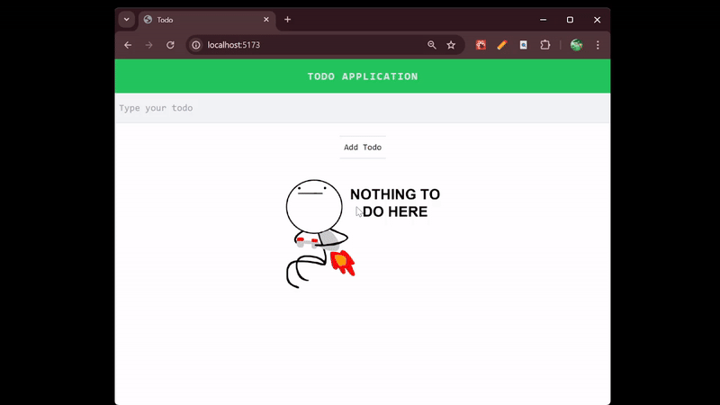

# Todo Application

*A simple todo application made with MongoDB, ExpressJs, ReactJs, NodeJs, TailwindCSS.*




## Functionalities

- View all todos
- Add todos
- Delete todos
- Modify todos

## Installation 

1. Clone the repository:
```bash
git clone https://github.com/varun77x/Todo.git
cd Todo
```

2. Install frontend dependencies:
```bash
cd frontend
npm install
```

3. Install backend dependencies:
```bash
cd backend
npm install
```
## Running the Application

1.Start the backend server
```bash
cd backend
nodemon server.js
```

2.Start the frontend development server
```bash
cd frontend
npm run dev
```
